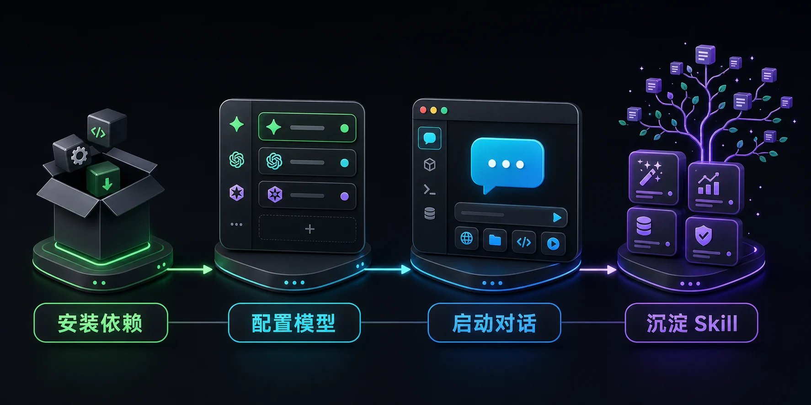
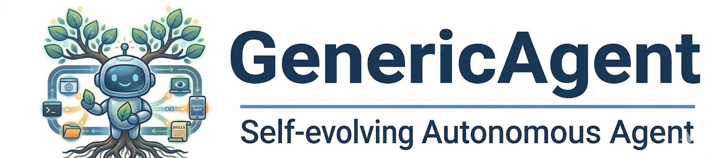

<!-- README-PROMO:START -->
<p align="center">
  
  
  
</p>
<!-- README-PROMO:END -->

<div align="center">

</div>

<h1 align="center">DabaoAgent — GenericAgent 中文一键绿色包</h1>

<p align="center">
  <a href="#about">关于本项目</a> |
  <a href="#quick-start">快速开始</a> |
  <a href="#api-config">API 配置</a> |
  <a href="#advanced">高级用法</a> |
  <a href="#faq">常见问题</a>
</p>

---
<a name="about"></a>
## 📌 关于本项目

**DabaoAgent** 是 [GenericAgent](https://github.com/lsdefine/GenericAgent)（lsdefine 原创）的**中文魔改一键绿色版本**。

> **GenericAgent** 是一个极简、可自我进化的自主 Agent 框架。核心仅 ~3K 行代码，通过 9 个原子工具 + ~100 行 Agent Loop，赋予任意 LLM 对本地计算机的系统级控制能力，覆盖浏览器、终端、文件系统、键鼠输入、屏幕视觉及移动设备（ADB）。

**本版本做了什么：**
- 🔤 **全部中文化**：README、配置模板、启动器标题等全部翻译为中文
- 📦 **一键绿色部署**：下载/克隆 → 装依赖 → 填 Key → 启动，无需复杂配置
- 🧹 **配置简化**：去除冗余注释，保留最实用的配置模板
- 🚀 **开箱即用**：默认推荐 DeepSeek / Claude / OpenAI 等主流模型配置

**原版项目：** [lsdefine/GenericAgent](https://github.com/lsdefine/GenericAgent) | [arXiv 技术报告](https://arxiv.org/abs/2604.17091)

---
<a name="quick-start"></a>
## 🚀 快速开始（4 步即可）

### 1️⃣ 安装依赖

```powershell
pip install requests streamlit pywebview
```

### 2️⃣ 配置 API Key

```powershell
copy mykey_template.py mykey.py
```

### 3️⃣ 编辑 mykey.py，填入你的 API Key

打开 `mykey.py`，找到 `native_oai_config`（或 `native_claude_config`），填入你的凭据。

**DeepSeek 示例：**
```python
native_oai_config = {
    'name': 'deepseek-v4-pro',
    'apikey': 'sk-你的key',
    'apibase': 'https://api.deepseek.com/v1',
    'model': 'deepseek-v4-pro',
}
```

**Claude（CC switch 渠道）示例：**
```python
native_claude_config0 = {
    'name': 'cc-relay-1',
    'apikey': 'sk-user-你的key',
    'apibase': 'https://你的渠道地址/claude/office',
    'model': 'claude-opus-4-7',
    'fake_cc_system_prompt': True,
    'thinking_type': 'adaptive',
}
```

**OpenAI 示例：**
```python
native_oai_config = {
    'name': 'gpt-native',
    'apikey': 'sk-你的key',
    'apibase': 'https://api.openai.com/v1',
    'model': 'gpt-4o',
}
```

### 4️⃣ 启动

```powershell
python launch.pyw
```

这会弹出一个独立的桌面聊天窗口（基于 pywebview + Streamlit），即可开始与 Agent 对话。

---
<a name="api-config"></a>
## ⚙️ API 配置速查

mykey.py 支持多种 LLM 配置，变量名决定 Session 类型：

| 变量名包含 | 走什么 Session | 说明 |
|---|---|---|
| `native` + `claude` | NativeClaudeSession | Anthropic 原生协议（推荐） |
| `native` + `oai` | NativeOAISession | OpenAI 兼容协议（DeepSeek/GPT/Gemini） |
| `mixin` | MixinSession | 多模型故障转移 |

### 推荐：MIXIN 故障转移

```python
mixin_config = {
    'llm_nos': ['deepseek-v4-pro', 'gpt-native'],  # 按优先级尝试
    'max_retries': 10,
    'base_delay': 0.5,
}
```

第一个模型失败后自动切下一个，省心。

---
<a name="advanced"></a>
## 🔧 高级用法

### 启动参数

```powershell
python launch.pyw --tg        # 同时启动 Telegram Bot
python launch.pyw --qq        # 同时启动 QQ Bot
python launch.pyw --feishu    # 同时启动飞书 Bot
python launch.pyw --wecom     # 同时启动企业微信 Bot
python launch.pyw --dingtalk  # 同时启动钉钉 Bot
python launch.pyw --sched     # 启动计划任务调度器
python launch.pyw --llm_no 1  # 指定使用第 2 个 LLM 配置
```

### 其他前端

```powershell
python frontends/qtapp.py          # Qt 桌面应用
python frontends/wechatapp.py      # 微信 Bot（扫码登录）
streamlit run frontends/stapp2.py  # 另一种 Streamlit UI
```

### 聊天命令

在对话框中输入：

| 命令 | 说明 |
|---|---|
| `/new` | 开启新对话并清空上下文 |
| `/continue` | 列出可恢复的对话 |
| `/continue N` | 恢复第 N 个对话 |

### 支持的模型平台

- **DeepSeek**：`https://api.deepseek.com/v1`，模型 `deepseek-chat` / `deepseek-v4-pro`
- **Claude（官方）**：`https://api.anthropic.com`，API Key 以 `sk-ant-` 开头
- **Claude（CC switch 渠道）**：第三方中转，需设 `fake_cc_system_prompt=True`
- **OpenAI**：`https://api.openai.com/v1`，模型 `gpt-4o` / `gpt-5` 等
- **智谱 GLM**：`https://open.bigmodel.cn/api/anthropic`
- **MiniMax**：`https://api.minimaxi.com/anthropic`
- **Kimi**：`https://api.kimi.com/coding`
- **OpenRouter**：`https://openrouter.ai/api/v1`，多模型中继

---
<a name="faq"></a>
## ❓ 常见问题

**Q: 第一次启动需要做什么？**
A: 安装依赖 → `copy mykey_template.py mykey.py` → 编辑 mykey.py 填 API Key → `python launch.pyw`

**Q: API Key 填在哪里？**
A: 打开 `mykey.py`，找到 `native_oai_config` 或 `native_claude_config`，把 `apikey` 和 `apibase` 填好。

**Q: 可以用哪些模型？**
A: 任何 OpenAI 兼容接口或 Anthropic 接口的模型都行，包括 DeepSeek、Claude、GPT、Gemini、智谱、Kimi、MiniMax 等。

**Q: mykey.py 会被上传到 Git 吗？**
A: 不会。`.gitignore` 已排除此文件，安全。

**Q: 什么是"自我进化"？**
A: Agent 每解决一个新任务，会把执行路径固化为 Skill 存入记忆层，下次同类任务直接调用。使用越久，专属技能树越丰富。

---
## 📊 原版特性

| 特性 | 说明 |
|---|---|
| **代码量** | ~3K 行核心代码 |
| **浏览器控制** | 注入真实浏览器（保留登录态） |
| **OS 控制** | 键鼠、视觉、ADB |
| **自我进化** | 自主生长 Skill 和工具 |
| **Token 效率** | 上下文窗口不到 30K |

---
## 📄 许可

MIT License — 原版 [lsdefine/GenericAgent](https://github.com/lsdefine/GenericAgent) 使用 MIT 协议。

*声明：本项目是 GenericAgent 的中文魔改一键版本，核心代码归属 lsdefine。除 DintalClaw 外，目前未官方授权任何机构、组织或个人以 DabaoAgent 名义从事商业活动。*
